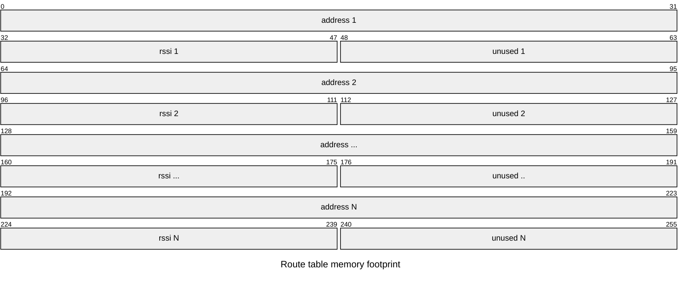
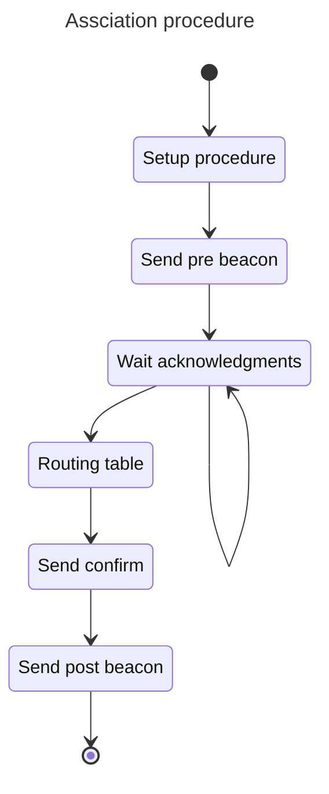
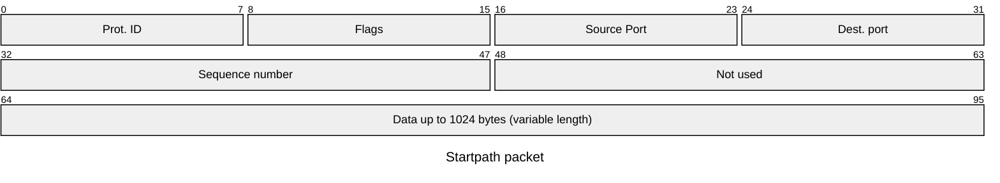

# Introduction

DRAFT DOCUMENT - WORK IN PROGRESS

The StarPath protocol is defined to give each node if the mesh network the ability to send asynchronous messages to the coordinator.
This protocol assumes that a packetbuf protocol is used as base protocol. This protocol will use broadcast protocol nad unicast protcol as
base protocol to self discovery and auto forming capabilities. 

The protocol provides procedures and methods to give the application programs the ability to send datagram packets to the coordinator node of
the network and the ability to receive back a reply.

## Definitions

- **Node**: A generic device able to implement a StartPath protocol stack
- **Coordinator**: A specific node that will be able receive packets from all nodes in a network.
- **Path**: A Sequence of nodes tha can be used to repeat the signal from the source node to the coordinator. 
- **Association**: The association is the ability of a node to find a path the will allow the communication with the coordinator
- **Bonding**: The bonding the ability to associate with a single coordinator network identified by the coordinator mac address.
- **Transmit**: The ability of a node to send data from itself to a coordinator using a path
- **Reply**: The ability of a coordinator to send a reply to an incoming data packet using the revere path of the transmit packet.

## Star topology

As the name state the protocol wil use a start network topology in which every node of the network will identify one (or more) path that can be used to reach the root node called coordinator. Considering the following figure N8 node can use the following path to reach the coordinator: *N8 --> N7 --> Coord* and the coordinator can reply back using the reverse of this path *Coord --> N7 --> N8* 

The protocol algorithm will convert a bidirectional connection graph like the following

   

To a tree connection graph

in which each node know of to reach the coordinator using it's parent as repeater.

## Hop definition

When a node (Ex. **N4**) want to reach **N0** (Coordinator) but can't reach directly it can use an hop. In this case it will send a unicast packet to its neighbor parent **N2**.
The node **N2** will receive an unicast packet that is not target for him but for N0 in that case the node must repeat the packets toward its parent using another unicast packet. 
This loop is repeated until the target packet is the node N0 that will receive the packet.

**TODO**: The **N0** node don't know how to reply to **N4** because it don't know the path to descended the tree back to **N2** so when the packet travels up to N0 we have to keep note of every hop that the packet has done (like the breadcrumbs of hansel and gretel  :blush:) In that way the return route will be embedded in the header of the received packet. The problem of this reasoning is that we have to allocate space for the full routing table (max hops) in the header of every sent packet.

## Routing table specification

Every node can describe a remote node reachability in form a routing table. The minimum number of hops is 1 (when the target is a neighbors of the source node). The maximum number is a constant define by the protocol. This will impact the memory footprint of the protocol.

| Row  |  Addr | RSSI  |
|------|-------|-------|
| 1    | N2    | Rssi1 |
| 2    | N4    | Rssi2 |
| 3    | N3    | Rssi3 |
| 4    | N1    | Rssi4 |
| 5    | N0    | Rssi5 |

Each row in the routing table identify an address, the target address to go from the current address and an RSSI. The index of the row will be the current hops that a node will carry on:

For example let say that **N5** what to reach the node **N0** using the previous routing table the path will be **N5** --> **N2** --> **N4** --> **N3** --> **N1** --> **N0**.

The first row of the routing table will be representing the first hop from the node **N5** to the node **N2** the second row is the hop from the node **N2** to the node **N4** and so on.

## State of the node

StarPath is a state protocol this mean that the result is not only dependent from the source and the target of the protocol but it depends also from the internal state of the protocol.

There are two main internal states:

- Associated to network: When a node is associated to a network it is ready to send a receive datagram packets to its destination.
- Not associated to a network: When a node is not associated 

## Association Procedure

- Every not associated node will send periodically a beacon packet in broadcast that will contains it's mac address.
- Every associated node that receive a beacon from a not associated node will reply with a acknowledgment packet using unicast.
- An acknowledgment packet is constituted by the full route the that this associated node must follow to reach the coordinator.
    - A route is a sequence of hops, it will be constituted by an array of and addresses and the corresponding **RSSI**.    
- The not associated node will wait until a timeout in order toi receive all acknowledgment packets from it's neighbors.
- For each acknowledgment packet received (or neighbor node discovered) the not associated node will computed the cost (**Cpath**) of using that node as route-
    - The overall cost will be computed the sum o costs of the singles hop. 
    - The cost of a single hop will have a fixed part base plus a variable part base on the **RSSI**. 
- The not associated node will select the neighbor will the best cost and create a new route to reach the coordinator.
- The first packet that the node will send is an association acknowledgment packet to the coordinator using the **starpath** protocol.
- The coordinator reply to the association acknowledgment with the association reply to the source node.
- The node consider itself associated to network and change its internal state to associated saving the selected rout in (ram or flash to be decided)  
- When a network is associated network can:
    - act as repeater for other nodes and will reply to beacons 
    - reply to beacons from other not associated nodes.

Observation based on previous experiences:

The non associated nodes will send beacons at random intervals because they are powered up at radom times. The consequence of this is that there is the possibility that the network can start forming from the weak nodes instead of the strong ones (Based on which node send the beacons first). If this happen there will be router built on weak connections thats not good.

One solution to that if that when a node finish the association procedure will send an 
beacon acknowledgment packet as well. In this way the neighbors can know the a new node has been associated to the network and change it's route table. But it yet to be defined.

## Packet header

