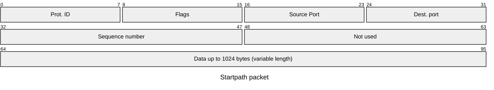

# Introduction

The StarPath protocol is defined to give each node if the mesh network the ability to send asynchronous messages to the coordinator.
This protocol assumes that a packetbuf protocol is used as base protocol. This protocol will use broadcast protocol nad unicast protcol as
base protocol to self discovery and auto forming capabilities. 

The protocol provides procedures and methods to give the application programs the ability to send datagram packets to the coordinator node of
the network and the ability to receive back a reply.

## Star topology

As the name state the protocol wil use a start network topology in which every node of the network will identify one (or more) path that can be used to reach the root node called coordinator. Considering the following figure N8 node can use the following path to reach the coordinator: *N8 --> N7 --> Coord* and the coordinator can reply back using the reverse of this path *Coord --> N7 --> N8* 

The protocol algorithm will convert a bidirectional connection graph like the following

   

To a tree connection graph

in which each node know of to reach the coordinator using it's parent as repeater.

## State of the node

Starpath is a state protocol this mean that the result is not only dependent from the source and the target of the protocol but it depends also from the internal state of the protocol.

There are two main internal states:

- Associated to network: When a node is associated to a network it is ready to send a receive datagram packets to its destination.
- Not associated to a network: When a node is not associated 

## Association Procedure

- Every not associated node will send periodically a beacon packet in broadcast that will contains it's mac address.
- Every associated node that receive a beacon from a not associated node will reply with a acknowledgment packet using unicast.
- An acknowledgment packet is constituted by the full route the that this associated node must follow to reach the coordinator.
    - A route is a sequence of hops, it will be constituted by an array of and addresses and the corresponding **RSSI**.    
- The not associated node will wait until a timeout in order toi receive all acknowledgment packets from it's neighbors.
- For each acknowledgment packet received (or neighbor node discovered) the not associated node will computed the cost (**Cpath**) of using that node as route-
    - The overall cost will be computed the sum o costs of the singles hop. 
    - The cost of a single hop will have a fixed part base plus a variable part base on the **RSSI**. 
- The not associated node will select the neighbor will the best cost and create a new route to reach the coordinator.
- The first packet that the node will send is an association acknowledgment packet to the coordinator using the **starpath** protocol.
- The coordinator reply to the association acknowledgment with the association reply to the source node.
- The node consider itself associated to network and change its internal state to associated saving the selected rout in (ram or flash to be decided)  
- When a network is associated network can:
    - act as repeater for other nodes and will reply to beacons 
    - reply to beacons from other not associated nodes.

Observation based on previous experiences:

The non associated nodes will send beacons at random intervals because they are powered up at radom times. The consequence of this is that there is the possibility that the network can start forming from the weak nodes instead of the strong ones (Based on which node send the beacons first). If this happen there will be router built on weak connections thats not good.

One solution to that if that when a node finish the association procedure will send an 
beacon acknowledgment packet as well. In this way the neighbors can know the a new node has been associated to the network and change it's route table. But it yet to be defined.

## Packet header

