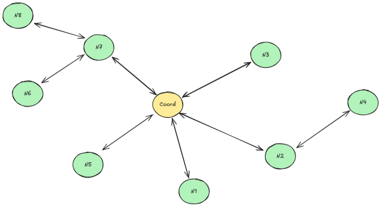
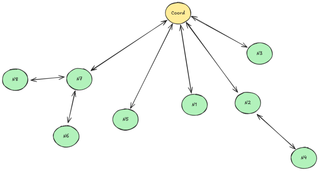
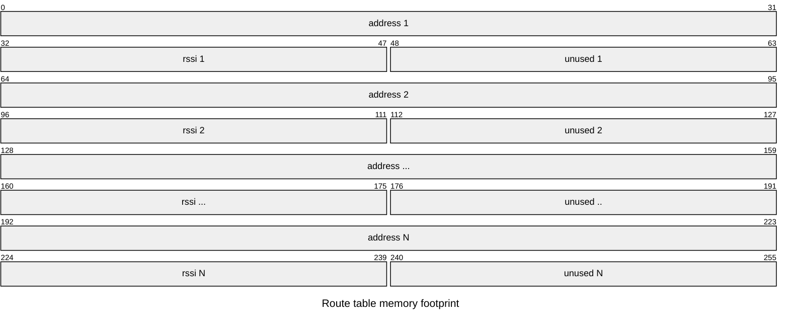
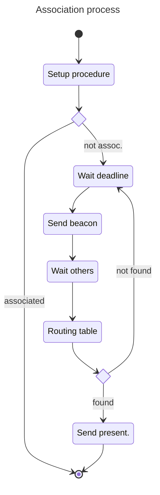
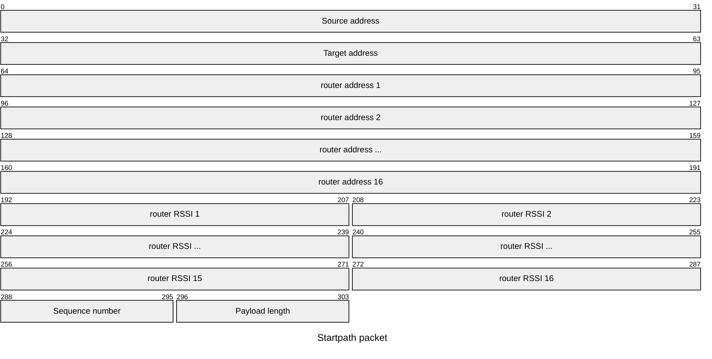

# Introduction

DRAFT DOCUMENT - WORK IN PROGRESS


The StarPath protocol is defined to give each node in the mesh network the ability to send asynchronous messages to the coordinator.
This protocol assumes that a packetbuf protocol is used as base protocol. This protocol will use broadcast and unicast protcol as
base protocol to self discovery and auto forming capabilities. 

The protocol provides procedures and methods to give the application programs the ability to send datagram packets to the coordinator node of the network and the ability to receive back a reply.

## Definitions

- **Node**: A generic device able to implement a StartPath protocol stack
- **Coordinator**: A specific node that will be able receive packets from all nodes in a network.
- **Hop**:
- **Path**: A Sequence of nodes tha can be used to repeat the signal from the source node to the coordinator. 
- **Association**: The association is the ability of a node to find the fastest path to communication with the coordinator
- **Bonding**: Bonding is the ability to associate with a single coordinator network identified by the coordinator mac address.
- **Transmit**: The ability of a node to send data from itself to a coordinator using a path
- **Reply**: The ability of a coordinator to send a reply to an incoming data packet using the revere path of the transmit packet.
- **Datagram packets**: 

## Star topology

As the name state the protocol wil use a star network topology in which every node of the network will identify one (or more) path that can be used to reach the root node called coordinator. Considering the following figure N8 node can use the following path to reach the coordinator: *N8 --> N7 --> Coord* and the coordinator can reply back using the reverse of this path *Coord --> N7 --> N8* 

The protocol algorithm will convert a bidirectional connection graph like the following

   

To a tree connection graph



in which each node know of to reach the coordinator using it's parent as repeater.

## Hop definition

When a node (Ex. **N4**) want to reach **Coord** (Coordinator) but can't reach it directly it can use an hop. In this case it will send a unicast packet to its neighbor parent **N2**.
The node **N2** will receive an unicast packet that is not target for him but for **Coord** in that case the node must repeat the packets toward its parent using another unicast packet. 
This loop is repeated until the target packet is the node **Coord** that will receive the packet.


**TODO**: The **Coord** node don't know how to reply to **N4** because it don't know the path to descended the tree back to **N2** so when the packet travels up to **Coord** we have to keep note of every hop that the packet has done (like the breadcrumbs of hansel and gretel  :blush:) In that way the return route will be embedded in the header of the received packet. The problem of this reasoning is that we have to allocate space for the full routing table (max hops) in the header of every sent packet.


## Routing table specification

Every node can describe a remote node reachability in form a routing table. The minimum number of hops is 1 (when the target is a neighbors of the source node). The maximum number is a constant define by the protocol. This will impact the memory footprint of the protocol.

| Row  |  Addr | RSSI  |
|------|-------|-------|
| 1    | N2    | Rssi1 |
| 2    | N4    | Rssi2 |
| 3    | N3    | Rssi3 |
| 4    | N1    | Rssi4 |
| 5    | N0    | Rssi5 |

Each row in the routing table identify an address, the target address to go from the current address and an RSSI. The index of the row will be the current hops that a node will carry on:

For example let say that **N5** what to reach the node **N0** using the previous routing table the path will be **N5** --> **N2** --> **N4** --> **N3** --> **N1** --> **N0**.

The first row of the routing table will be representing the first hop from the node **N5** to the node **N2** the second row is the hop from the node **N2** to the node **N4** and so on.



## State of the node

StarPath is a state protocol this mean that the result is not only dependent from the source and the target of the protocol but it depends also from the internal state of the protocol.

There are two main internal states:

- Associated to network: When a node is associated to a network it is ready to send a receive datagram packets to its destination.
- Not associated to a network: When a node is not associated 


## Association process

The main purpose of the association process is to associate that is not yet able to reach the coordinator with a neighbor node already able reach it.

The association process must respect the following requirements:

1. Every not associated node will send periodically a beacon packet in broadcast that will contains it's mac address.
2. Every associated node that receive a beacon from a not associated node will reply with a acknowledgment packet using unicast.
3. An acknowledgment packet must contains at least the total cost and number of hops obtained by using the sender node as path to reach the coordinator.
4. The cost is a value that can go from 0 to 100 and is a model of the probability to have a transmission error using the selected path. The cost is computed using the **RSSI** provided by the nodes during the transmissions of the beacon packet..    
5. Not all neighbors must reply at the same time but there must be a random delay between communications of the nodes to reduce the probability of channel saturation.
6. The not associated node must keep note of of replies from neighbors.
7. The not associated node must wait until all neighbors complete its transmissions.
8. The not associated node must select the best neighbor and associate with it.
9. The not associated node must compute the cost and the number of hops need to reach the coordinator using the selected neighbors.
10. If a best neighbor is found the node will change its state from not associated to associated.
11. The new associated node will send a **Presentation** packet to the coordinator.




The process will continue until a neighbor is found and the association is done.

The non associated nodes will send beacons at random intervals because they are powered up at radom times. The consequence of this is that there is the possibility that the network can start forming from the weak nodes instead of the strong ones (Based on which node send the beacons first). If this happen there will be router built on weak connections thats not good.

??? One solution to that if that when a node finish the association procedure will send a beacon acknowledgment packet as well. In this way the neighbors can know the a new node has been associated to the network and change it's route table. But it yet to be defined. ???

## Packet header

```c
struct StarPathHeaderSt {
    uint8_t protocol;
    uint8_t flags;
    uint8_t port;
    uint8_t pktType;
    uint16_t seqno;
    uint16_t payloadLength;
} __attribute__ ((packed));
typedef struct StarPathHeaderSt StarPathHeader;
```

## Packet additional header

The StarPath additional header is used to send information about the path done by the packet to reach the target. The packet is created by the source node and every router that will contribute to the path will add its information and will increment the field hopIndex.
The information collected in this header can be used by the target to send a reply back to the originator node.

```c
enum StarPathDirection {
    ToCoordinator,
    ToNode
};

struct StarPathPath_st {
    uint32_t sourceAddress;
    uint32_t targetAddress;
    uint32_t routerAddressses[16];
    int16_t hopsRssi[16];
    uint8_t hopsCount;
    uint8_t hopIndex;
    StarPathDirection direction;
} __attribute__ ((packed));
typedef struct StarPathPath_st StarPathPath;
```


